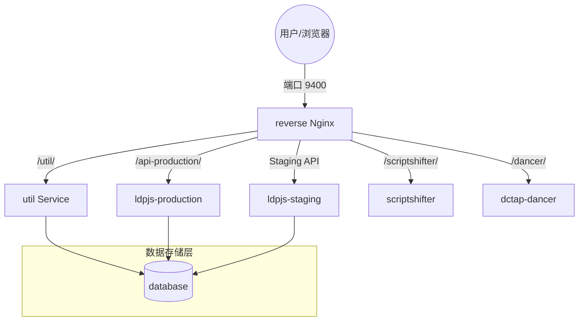

## BIBFRAME 总览
- 美国国会图书馆基于BIBFRAME编目，开源了很多相关生态的基础组件，我在这里梳理、总结一下整个美国国会图书馆的开源组件生态，尝试将主要的开源组件把玩一下，测试一下其组件基础的能力，并尝试集成一下各组件，验证能否形成一个完整的业务生态闭环。


### BIBFRAME编辑器

- 源码地址：https://github.com/lcnetdev/marva-quartz

- 使用方法：
  - 1. 执行以下shell脚本，编译运行
```sh
git clone https://github.com/lcnetdev/marva-quartz.git
cd marva-quartz
npm install
npm run dev-external
```
  - 2. 本地访问：http://localhost:4444/bfe2/quartz/


### 编辑器后端服务

- 地址：ttps://github.com/lcnetdev/marva-backend


#### 核心后端服务组件

1.  **`util`** (Util Service)
    *   **角色**: **业务逻辑中枢 / 胶水层**
    *   **功能**:
        *   处理部署脚本（`deploy-staging.sh`, `deploy-production.sh`）。
        *   提供 MARC 预览和转换接口。
        *   Git 仓库同步操作。
        *   作为项目的主要 API 后端，连接各个模块。
    *   **构建源**: `util-service` 目录 + `config/util.docker`。

2.  **`ldpjs-staging`** & **`ldpjs-production`** (Linked Data Platform Service)
    *   **角色**: **数据存储与检索引擎 (RDF/Bibframe)**
    *   **功能**:
        *   分别负责 **测试环境 (Staging)** 和 **生产环境 (Production)** 的数据存取。
        *   实现了 LDP (Linked Data Platform) 协议。
        *   负责将 Bibframe 数据写入 MongoDB 并生成检索索引。
    *   **构建源**: `ldpjs` 子模块 + `config/ldpjs.docker`。
    *   **关键点**: 这两个服务共享同一份代码，但使用不同的配置文件 (`ldpjs_config_staging.js` vs `ldpjs_config_production.js`) 和数据库集合。

3.  **`scriptshifter`** (Scriptshifter Service)
    *   **角色**: **多语言字符转换与翻译服务**
    *   **功能**:
        *   负责将非拉丁字符（如中文、日文、阿拉伯文）转写为拉丁字母（罗马化）。
        *   处理 MARC 到 Bibframe 的转换以及其他字符编码转换任务。
    *   **来源**: 使用官方镜像 `lcnetdev/scriptshifter:latest`。

4.  **`dctap-dancer`** (DCTAP Dancer Service)
    *   **角色**: **元数据应用配置文件 (Application Profile) 编辑器后端**
    *   **功能**:
        *   提供 API 用于管理、验证和导入/导出元数据录入模板（Profile）。
        *   基于 DC TAP 标准。
    *   **构建源**: `dctap-dancer` 子模块 + `Dockerfile`。

5.  **`database`** (MongoDB)
    *   **角色**: **核心数据库**
    *   **功能**:
        *   存储所有的 Bibframe 资源数据（JSON-LD/RDF）。
        *   存储 `util` 服务和 `ldpjs` 服务所需的配置和状态。
    *   **来源**: `mongo:4.4.4` 官方镜像。
    *   **配置**: 启动时会加载 `config/init-mongo.js` 进行初始化。

6.  **`reverse`** (Nginx)
    *   **角色**: **反向代理 / API 网关**
    *   **功能**:
        *   作为所有流量的统一入口（端口 9400）。
        *   根据 URL 路径（如 `/editor`, `/util`, `/scriptshifter`）将请求分发给上述各个后端服务。
        *   提供静态资源文件服务（前端页面）。
    *   **来源**: `nginx:stable-alpine` 官方镜像。

#### 组件关系图解




- 使用方法：
  - 1. 执行以下shell脚本，编译运行
```sh

```