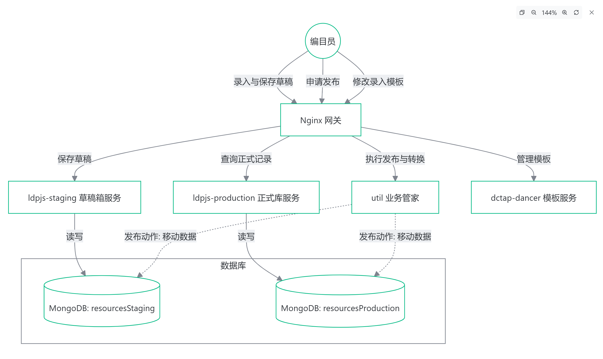

## BIBFRAME 总览
- 美国国会图书馆基于BIBFRAME编目，开源了很多相关生态的基础组件，我在这里梳理、总结一下整个美国国会图书馆的开源组件生态，尝试将主要的开源组件把玩一下，测试一下其组件基础的能力，并尝试集成一下各组件，验证能否形成一个完整的业务生态闭环。


### BIBFRAME编辑器

- 源码地址：https://github.com/lcnetdev/marva-quartz

#### 使用方法：
  - 1. 执行以下shell脚本，编译运行
```sh
git clone https://github.com/lcnetdev/marva-quartz.git
cd marva-quartz
npm install
npm run dev-external
```
  - 2. 本地访问：http://localhost:4444/bfe2/quartz/


### 编辑器后端服务

- 地址：ttps://github.com/lcnetdev/marva-backend


#### 核心后端服务组件

1.  **`util`** (Util Service)
    *   **角色**: **业务管家**
    *   **功能**:
        *   不仅是“胶水层”，它更像是整个应用的大脑。
        *   负责处理复杂的业务动作，比如“发布”（将数据从暂存区推送到正式区或外部系统）。
        *   提供辅助功能，如 MARC 格式预览、Git 数据同步。
    *   **关键点**: 它直接连接数据库，并协调其他服务。

2.  **`ldpjs-staging`** (Staging Data Service)
    *   **角色**: **草稿箱存储服务**
    *   **功能**:
        *   专门负责存储**正在编辑中、未完成**的编目数据。
        *   数据存放在 `resourcesStaging` 集合中。
        *   允许频繁的读写操作，主要服务于编辑器的“保存草稿”功能。

3.  **`ldpjs-production`** (Production Data Service)
    *   **角色**: **正式库存储服务**
    *   **功能**:
        *   专门负责存储**已发布、生效**的编目数据。
        *   数据存放在 `resourcesProduction` 集合中。
        *   作为数据的“最终归宿”，供查询和对外发布使用。

4.  **`scriptshifter`** (Translation Service)
    *   **角色**: **多语言转写助手**
    *   **功能**:
        *   在编目过程中，实时将非拉丁语系文字（如中文标题）转写为拉丁字母拼音。
        *   是一个纯粹的工具服务，无状态。

5.  **`dctap-dancer`** (Profile Editor Backend)
    *   **角色**: **规则模板管理器**
    *   **功能**:
        *   管理“编目规则”（Profile）。
        *   编目员通过它来定义：在录入某类书时，哪些字段是必填的，哪些字段需要下拉菜单。
        *   这些规则定义了 `ldpjs` 中数据的形状。

6.  **`database`** (MongoDB)
    *   **角色**: **数据中心**
    *   **功能**:
        *   物理存储所有数据，包括：草稿数据 (`resourcesStaging`)、正式数据 (`resourcesProduction`)、用户信息、配置信息等。

7.  **`reverse`** (Nginx Gateway)
    *   **角色**: **前台接待**
    *   **功能**:
        *   统一入口，根据请求类型将用户引导到不同的服务窗口（是存草稿？还是查正式记录？还是修改模板？）。

#### 组件关系图解




#### 详细启动步骤：

**步骤一：初始化代码仓库**
由于项目依赖多个 Git 子模块 (`ldpjs`, `scriptshifter`, `dctap-dancer`)，首次启动前必须初始化它们，否则构建会失败。

```bash
git submodule update --init --recursive
```

**步骤二：配置环境变量 (.env)**
项目根目录缺少 `.env` 文件，这是启动必须的。请在项目根目录 (`d:\repo\marva-backend\`) 创建一个名为 `.env` 的文件，并填入以下配置（根据 `server.js` 和 `docker-compose.yml` 分析得出）：

```sh
# --- 数据库配置 ---
# MongoDB 内部连接使用，通常不需要修改
MONGO_INITDB_DATABASE=bfe2

# --- 外部服务认证 (MarkLogic / API) ---
# 请根据实际情况填写，本地开发如果无真实服务可尝试填入占位符
MLUSER=your_ml_user
MLPASS=your_ml_password
MLUSERSTAGE=your_stage_user
MLPASSSTAGE=your_stage_password

# --- 服务 URL 配置 ---
STAGINGPOSTURL=http://example.com/stage/post
PRODUCTIONPOSTURL=http://example.com/prod/post
STAGGINGccURL=http://example.com/stage/cc
PRODUCTIONccURL=http://example.com/prod/cc
VALIDATIONURL=http://example.com/validate

# --- NACO 服务存根 ---
STAGINGNACOSTUB=http://example.com/stage/naco
PRODUCTIONNACOSTUB=http://example.com/prod/naco

# --- WorldCat OAuth 配置 ---
WC_CLIENTID=your_worldcat_client_id
WC_SECRET=your_worldcat_secret

# --- 功能开关 ---
LCAP_SYNC=false
RECORD_HISTORY=true
BFORGMODE=false

# --- Scriptshifter 配置 ---
TXL_FLASK_SECRET=1234567890
```
> **注意**：上述 `your_...` 和 `http://example.com/...` 是占位符。如果您没有真实的后端凭据，本地启动可能无法连接外部 API，但容器本身应该能成功运行。

**步骤三：启动服务**
在项目根目录下运行 Docker Compose 命令构建并启动所有服务：

```bash
docker-compose up --build -d
```
*   `--build`: 强制重新构建镜像（确保子模块代码被正确打包）。
*   `-d`: 后台运行。

#### 4. 验证与访问

启动完成后，您可以通过以下方式验证：

1.  **检查容器状态**：
    ```bash
    docker-compose ps
    ```
    确保所有容器（尤其是 `reverse`, `util`, `database`）的状态为 `Up`。

2.  **访问应用**：
    项目通过 Nginx 暴露在 **9400** 端口。
    *   **主页/编辑器**: [http://localhost:4444/bfe2/quartz/](http://localhost:4444/bfe2/quartz/)
    *   **Util API**: [http://localhost:9400/util/](http://localhost:9400/util/)


