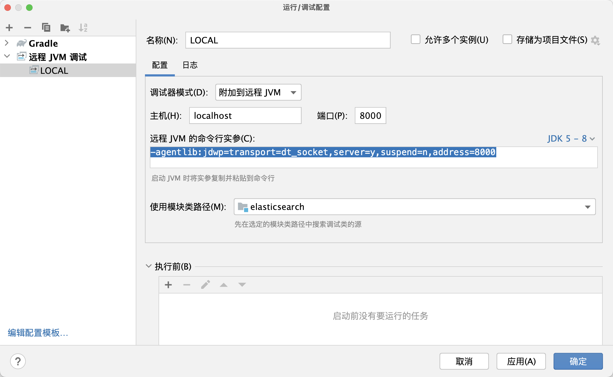

- 用于个人学习总结ElasticSearch
- 包括基础使用、运行机制、源码解析等
- 源码基于 6.1 分支: [ElasticSearch-6.1分支代码](https://github.com/elastic/elasticsearch/tree/6.1)

## 目录

- [如何调试](#如何调试)
- [ES集群启动步骤](#ES集群启动步骤)
- [ES节点启动](#ES节点启动)

### 如何调试

- 1. 编译构建elasticsearch工程: `./gradlew assemble`
- 2. 将工程集成到IDEA: `./gradlew idea`，用IDEA打开elasticsearch工程
- 3. 执行 `./gradlew :run --debug-jvm`，启动调试模式.
- 4. debug启动之后，观察日志：`[elasticsearch] Listening for transport dt_socket at address: 8000`发现debug端口为`8000`.
- 5. 添加远程JVM调试，主机填`localhost`,端口配置为`8000`,JDK选择 `5-8`，点击确定启动debug
- 
- 6. 可以观察日志，服务已经正常启动

```log
[elasticsearch] [2023-07-26T16:19:14,233][INFO ][o.e.t.TransportService   ] [node-0] publish_address {127.0.0.1:9300}, bound_addresses {[::1]:9300}, {127.0.0.1:9300}
[elasticsearch] [2023-07-26T16:19:17,300][INFO ][o.e.c.s.MasterService    ] [node-0] zen-disco-elected-as-master ([0] nodes joined), reason: new_master {node-0}{48qziOzRTdOSQo0nQhQ_PQ}{udw-kDLxTNCvBvup2R2Nqw}{127.0.0.1}{127.0.0.1:9300}{testattr=test}
[elasticsearch] [2023-07-26T16:19:17,304][INFO ][o.e.c.s.ClusterApplierService] [node-0] new_master {node-0}{48qziOzRTdOSQo0nQhQ_PQ}{udw-kDLxTNCvBvup2R2Nqw}{127.0.0.1}{127.0.0.1:9300}{testattr=test}, reason: apply cluster state (from master [master {node-0}{48qziOzRTdOSQo0nQhQ_PQ}{udw-kDLxTNCvBvup2R2Nqw}{127.0.0.1}{127.0.0.1:9300}{testattr=test} committed version [1] source [zen-disco-elected-as-master ([0] nodes joined)]])
[elasticsearch] [2023-07-26T16:19:17,329][INFO ][o.e.g.GatewayService     ] [node-0] recovered [0] indices into cluster_state
[elasticsearch] [2023-07-26T16:19:17,331][INFO ][o.e.h.n.Netty4HttpServerTransport] [node-0] publish_address {127.0.0.1:9200}, bound_addresses {[::1]:9200}, {127.0.0.1:9200}
[elasticsearch] [2023-07-26T16:19:17,333][INFO ][o.e.n.Node               ] [node-0] started
<============-> 96% EXECUTING [11m 35s]
> :distribution:run#start
> IDLE
```

- 7. 在浏览器访问: `http://127.0.0.1:9200/`

```json
{
  "name" : "node-0",
  "cluster_name" : "distribution_run",
  "cluster_uuid" : "otLdQ8YGRDuaRDHHW2ly9w",
  "version" : {
    "number" : "6.1.5",
    "build_hash" : "c975590",
    "build_date" : "2023-07-13T06:34:36.143Z",
    "build_snapshot" : true,
    "lucene_version" : "7.1.0",
    "minimum_wire_compatibility_version" : "5.6.0",
    "minimum_index_compatibility_version" : "5.0.0"
  },
  "tagline" : "You Know, for Search"
}
```

### ES集群启动步骤

- 1. 选举主节点（过半数为master节点）
- 2. 选举集群元信息
- 3. allocation分配数据分片
- 4. index recovery 索引重启恢复
- 5. 集群启动

### ES 数据模型

- 1 数据副本模型基于主从模式（或称主备模式，HDFS和 Cassandra为对等模式），在实现过程中参考了微软的PacificA算法
- 2 数据副本模型：
  - ES的数据副本模型基于主备模式
  - 每个索引都会被拆分为多个分片，并且每个分片都有多个副本(这些副本称为replication group)
- 3 写入过程：
  - 请求到达协调节点：（request->coordinator）
  - 协调节点先验证操作：（coordinator->validation）
  - 协调节点转发到主分片（coordinator—>routing to-> master node)
  - 主节点本地更新操作（ master node update）
  - 主节点下发数据同步给副本节点组（master node->slave nodes）
  - 一旦所有的副分片成功执行操作并回复主分片，主分片会把 请求执行成功的信息返回给协调节点，协调节点返回给客户端
- 4 故障处理
  - 出现主分片错误：如离线、磁盘损坏等，会超时（1分钟）之后主动降级，提升一个副分片为主分片
  - 出错的主分片操作会被副分片拒绝：来自陈旧的主分片的操作将会被副分片拒绝。当它接收来自副分片的拒绝其请求的响应时，它将会访问一下（新）主节点，然后就会知道自己已被替换。最后将操作路由到新的主分片。
- 5 读取模型
  - 把读请求转发到相关分片
  - 从副本组中选择一个相关分片的活跃副本
  - 发送分片级的读请求到被选中的副本
  - 合并结果并给客户端返回响应

### ES主分片选举策略（Allocation IDs）

- 安全地分配主分片
  - 分片决策过程在主节点完成，并记录在集群状态中
  - 为了确保安全，主节点必须确保被选为主分片的副本含有最新数据。为 此，ES 使用 Allocation IDs 的概念，这是区分不同分片的唯一标识
- 分片时序id(Sequence IDs)
  - 本地及全局检查点（global checkpoint） ：全局检查点是所有活跃分片历史都已对齐的序列号，换句话说，所 有低于全局检查点的操作都保证已被所有活跃的分片处理完毕。这意味 着，当主分片失效时，我们只需要比较新主分片与其他副分片之间的最 后一个全局检查点之后的操作即可。当旧主分片恢复时，我们使用它知 道的全局检查点，与新主分片进行比较。这样，我们只有小部分操作需 要比较，不用比较全部
- _version
  - 1.是实现乐观锁，如同其他数据库的乐观锁一 样。我们在写请求中指定文档的版本号，如果文档的当前版本与请求中 指定的版本号不同，则请求会失败。
  - 2.当文档被修改时版本号递 增。ES 使用这个_version来确保变更以正确顺序执行
  