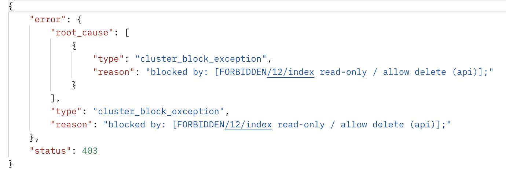
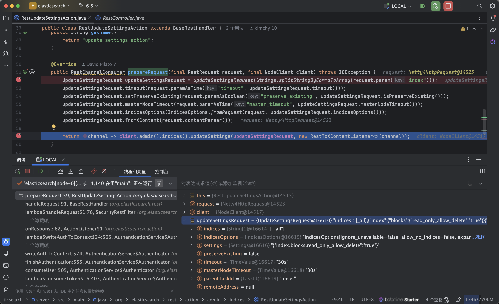
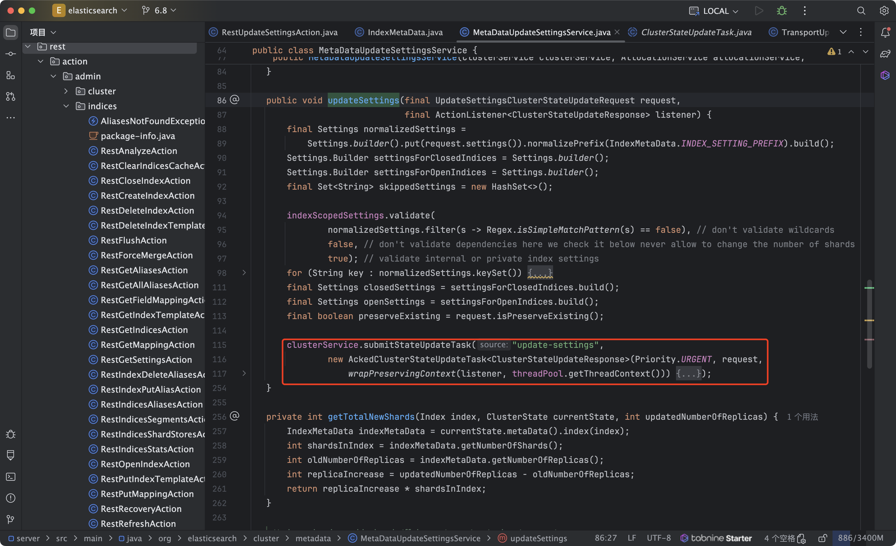

## 目录

- [环境信息](#环境信息)
- [现象](#现象)
- [分析](#分析)
- [源码调试解析过程](#源码调试解析过程)

### 环境信息

- elasticsearch 6.8.2
- jdk-8
- cpu-24核心、64gb内存
- 数据量：943GB

### 现象

- 1.在进行对索引写入数据的时候，报出异常：`forbidden/12/index read-only / allow delete (api) status 403`
  - 
  - 

- 2. 单节点批量写入数据，性能较低，2亿条数据，导数耗时5个多小时，需要优化导数性能
- 3. es节点磁盘剩余空间50%
- 4. JVM内存堆大小为23GB，在大量写入数据的时候，出现频繁的full gc

### 分析

- 1. 内存不足
  - JVMMemoryPressure 超过92%并持续30分钟时，ES触发保护机制，并且阻止写入操作，以防止集群达到红色状态，启用写保护后，写入操作将失败，并且抛出 ClusterBlockException ，无法创建新索引，并且抛出 IndexCreateBlockException ,当五分钟内恢复不到88%以下时，将禁用写保护。
  - ES内存压力保护机制说明：https://www.elastic.co/guide/en/cloud/current/ec-memory-pressure.html

- 2. 磁盘空间不足
  - es的默认磁盘水位警戒线是85%，一旦磁盘使用率超过85%，es不会再为该节点分配分片，es还有一个磁盘水位警戒线是90%，超过后，将尝试将分片重定位到其他节点。

- 3. 写入性能低：目前索引的副本数为1，分片数为2，2000万数据写入，es耗时为162分钟。目前看已经达到单点性能上限。目前环境总量数据有27.7亿条数据，磁盘占用空间为943GB，ES官方推荐内存比数据为1:10的比例，那么就需要90GB左右的JVM堆内存空间，目前只有1个ES单节点（30GB内存），建议再扩展2个ES节点，可以加快导数速度，保证准生产环境的稳定运行。

### 解决方案

- 1. 磁盘扩容，增加索引shards分片数，分摊节点磁盘写入压力
- 2. 再扩展2个ES数据节点，扩展整个es集群内存，降低内存压力，避免触发自动保护机制
- 3. 手动修改历史索引的_settings，将 index.blocks.read_only_allow_delete 改成 false，保证索引的可用性。

### 源码调试解析过程

#### 场景1. 手动设置为只读索引

- 1.添加样例测试索引： `http://localhost:9200/sample_index/_doc/1`

```json
{
"foo": "bar"
}
```

- 2.更新所有索引的属性为只读索引：`http://localhost:9200/_all/_settings`

```json
{"index.blocks.read_only_allow_delete": true}
```

- 3.查看样例测试索引：`http://localhost:9200/sample_index?pretty`

```json
{
  "sample_index" : {
    "aliases" : { },
    "mappings" : {
      "_doc" : {
        "properties" : {
          "foo" : {
            "type" : "text",
            "fields" : {
              "keyword" : {
                "type" : "keyword",
                "ignore_above" : 256
              }
            }
          }
        }
      }
    },
    "settings" : {
      "index" : {
        "number_of_shards" : "5",
        "blocks" : {
          "read_only_allow_delete" : "true"
        },
        "provided_name" : "sample_index",
        "creation_date" : "1718608529424",
        "number_of_replicas" : "1",
        "uuid" : "v6koutd3Sz2A0YxX985YLA",
        "version" : {
          "created" : "6082499"
        }
      }
    }
  }
}
```

- 调试rest请求入口：`org.elasticsearch.rest.action.admin.indices.RestUpdateSettingsAction#prepareRequest`

- 这里调用 `org.elasticsearch.client.IndicesAdminClient#updateSettings` 异步更新索引设置

- es通过网络通讯，调用master节点，调用网络方法`org.elasticsearch.cluster.metadata.MetaDataUpdateSettingsService#updateSettings`执行索引配置更新，索引的更新逻辑`clusterService.submitStateUpdateTask`在方法中调用。


- 调用方法`org.elasticsearch.common.settings.AbstractScopedSettings#updateDynamicSettings`更新对应索引配置

#### 场景2. 自动触发为只读索引

- 根据网络资料提示，在JVM的内存达到压力阈值或者磁盘到达阈值时，会进行自动将索引状态更新为只读索引
