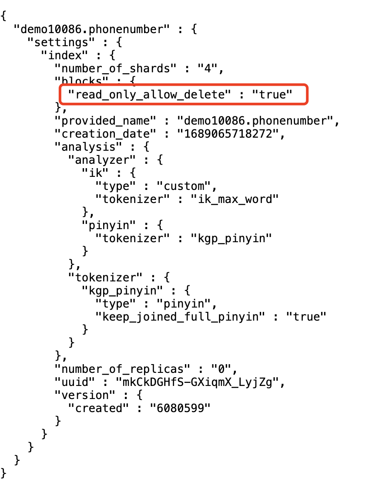

## 目录

- [环境信息](#环境信息)
- [现象](#现象)
- [分析](#分析)
- [源码解析](#源码解析)

### 环境信息

- elasticsearch 6.8.2
- jdk-8
- cpu-24核心、64gb内存
- 数据量：943GB

### 现象

- 1.在进行对索引写入数据的时候，报出异常：`forbidden/12/index read-only / allow delete (api) status 403`
  - 
  - 

- 2. 单节点批量写入数据，性能较低，2亿条数据，导数耗时5个多小时，需要减少导数时间，优化导数性能

### 分析

- 1. 内存不足
  - JVMMemoryPressure 超过92%并持续30分钟时，ES触发保护机制，并且阻止写入操作，以防止集群达到红色状态，启用写保护后，写入操作将失败，并且抛出 ClusterBlockException ，无法创建新索引，并且抛出 IndexCreateBlockException ,当五分钟内恢复不到88%以下时，将禁用写保护。
  - ES内存压力保护机制说明：https://www.elastic.co/guide/en/cloud/current/ec-memory-pressure.html

- 2. 磁盘空间不足
  - es的默认磁盘水位警戒线是85%，一旦磁盘使用率超过85%，es不会再为该节点分配分片，es还有一个磁盘水位警戒线是90%，超过后，将尝试将分片重定位到其他节点。

- 3. 写入性能低：目前索引的副本数为1，分片数为2，2000万数据写入，es耗时为162分钟。目前看已经达到单点性能上限。目前环境总量数据有27.7亿条数据，磁盘占用空间为943GB，ES官方推荐内存比数据为1:10的比例，那么就需要90GB左右的JVM堆内存空间，目前只有1个ES单节点（30GB内存），建议再扩展2个ES节点，可以加快导数速度，保证准生产环境的稳定运行。

### 解决方案

- 1. 磁盘扩容，增加索引shards分片数，
- 2. 增加数据节点，扩展集群内存
- 3. 手动将 index.blocks.read_only_allow_delete 改成false

### 源码解析
