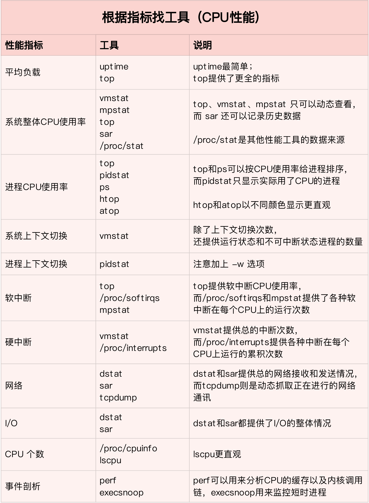

- 总结、收集 Linux 实用命令、系统应用调优相关的技巧
- 本文基于 Ubuntu-22.04、Centos-7 版本

## 场景

- [内存问题分析](#内存问题分析)
- [CPU问题分析](#CPU问题分析)

## 目录

- [系统信息-top](#top)
- [系统信息-watch](#watch)
- [系统信息-pidstat](#pidstat)
- [系统信息-mpstat](#mpstat)
- [系统信息-vmstat](#vmstat)
- [系统信息-dstat](#dstat)
- [系统信息-cachestat](#cachestat)
- [系统信息-cachetop](#cachetop)
- [系统信息-slabtop](#slabtop)
- [系统信息-strace](#strace)
- [系统信息-perf](#perf)
- [系统信息-pstree](#pstree)
- [系统信息-valgrind](#valgrind)
- [网络信息-tcpdump](#tcpdump)
- [系统测试-stress](#stress)
- [系统测试-iperf](#iperf)
- [系统测试-sysbench](#sysbench)
- [系统测试-dd](#dd)
- [内核信息-procfs](#procfs)

### CPU问题分析

### 内存问题分析

## 系统信息

### top

- [简介]: top （table of processes）是一个任务管理器程序，它可运行于许多类Unix操作系统上，它用于显示有关CPU和内存利用率的信息。

- us: 用户态使用率
- sy: 内核态使用率
- id: 空闲率
- Mem: 物理内存使用量
- Swap: 虚拟内存分区使用量
- 进程关键指标: S 列（也就是 Status 列）含义
  - R 是 Running 或 Runnable 的缩写，表示进程在 CPU 的就绪队列中，正在运行或者正在等待运行。
  - D 是 Disk Sleep 的缩写，也就是不可中断状态睡眠（Uninterruptible Sleep），一般表示进程正在跟硬件交互，并且交互过程不允许被其他进程或中断打断。
  - Z 是 Zombie 的缩写，如果你玩过“植物大战僵尸”这款游戏，应该知道它的意思。它表示僵尸进程，也就是 进程实际上已经结束了，但是父进程还没有回收它的资源（比如进程的描述符、PID 等）。
  - I 是 Idle 的缩写，也就是空闲状态，用在不可中断睡眠的内核线程上。前面说了，硬件交互导致的不可中断进程用 D 表示，但对某些内核线程来说，它们有可能实际上并没有任何负载，用 Idle 正是为了区分这种情况。要注意，D 状态的进程会导致平均负载升高，I 状态的进程却不会。
- VIRT 是进程虚拟内存的大小，只要是进程申请过的内存，即便还没有真正分配物理内存，也会计算在内。
- RES 是常驻内存的大小，也就是进程实际使用的物理内存大小，但不包括 Swap 和共享内存。
- SHR 是共享内存的大小，比如与其他进程共同使用的共享内存、加载的动态链接库以及程序的代码段等。
- %MEM 是进程使用物理内存占系统总内存的百分比。

### watch

- [简介]: Linux中的watch 命令提供了一种方式处理重复的任务。默认watch会每2秒重复执行命令。你一定也想到了,watch是一个很好的观察log文件的工具。下面是一个例子。
- 例如执行命令` watch -n 1 -d ps ` 每隔一秒高亮显示进程信息

### pidstat

- [简介]:
- 样例: 如监控进程pid`4344`]信息: `pidstat -d -p 4344 1 3`，-d 展示 I/O 统计数据，-p 指定进程号，间隔 1 秒输出 3 组数据
- 参数含义: kB_rd 表示每秒读的 KB 数， kB_wr 表示每秒写的 KB 数，iodelay 表示 I/O 的延迟（单位是时钟周期）

### dstat

- [简介] dstat 是一个新的性能工具，它吸收了 vmstat、iostat、ifstat 等几种工具的优点，可以同时观察系统的 CPU、磁盘 I/O、网络以及内存使用情况。
- 安装执行命令 `apt install dstat -y`

### mpstat

- [简介]

### vmstat

- [简介]

### cachestat

- [简介] 缓存命中率
- [样例] `cachestat 1 3`
- [参数含义]
  - TOTAL ，表示总的 I/O 次数；
  - MISSES ，表示缓存未命中的次数；
  - HITS ，表示缓存命中的次数；
  - DIRTIES， 表示新增到缓存中的脏页数；
  - BUFFERS_MB 表示 Buffers 的大小，以 MB 为单位；
  - CACHED_MB 表示 Cache 的大小，以 MB 为单位

### cachetop

- [简介] 缓存命中率：输出跟 top 类似，默认按照缓存的命中次数（HITS）排序，展示了每个进程的缓存命中情况。具体到每一个指标，这里的 HITS、MISSES 和 DIRTIES ，跟 cachestat 里的含义一样，分别代表间隔时间内的缓存命中次数、未命中次数以及新增到缓存中的脏页数。
- [样例] `cachetop`

### slabtop

- [简介] 实时显示内核slab内存缓存信息，使用 slabtop ，来找到占用内存最多的缓存类型。
- [样例] `slabtop`

### strace

- [简介] 跟进程系统调用的工具,观察对应pid进程的系统调用
- [安装] `apt install strace`
- [样例]: 运行 strace 命令，并用 -p 参数指定 PID 号 `strace -p 6082`

### perf

- [简介]
- [安装]
- [样例]: 采样操作系统函数调用 `perf record -g`，获取调用报告 `perf report`

### pstree

- [简介]
- [样例] `pstree -aps 3084`; a 表示输出命令行选项 ; p 表 PID; s 表示指定进程的父进程

### valgrind

- [简介] 内存泄露检测工具，应用最广泛的工具，一个重量级的内存检查器，能够发现开发中绝大多数内存错误使用情况
- [内存检测王者之剑—valgrind](https://zhuanlan.zhihu.com/p/56538645)

## 网络信息

### tcpdump

- [简介]

## 系统测试

### stress

- [简介] cpu、io 压测测试

### iperf

- [简介] 网络性能测试

### sysbench

- [简介]

### dd

- [简介]Linux dd 命令用于读取、转换并输出数据。dd 可从标准输入或文件中读取数据，根据指定的格式来转换数据，再输出到文件、设备或标准输出。
- [使用场景]适用于测试磁盘的顺序读写场景
- [样例] 生成一个 512MB 的临时文件 `dd if=/dev/sda1 of=file bs=1M count=512`，
- [样例] 写入指定目录文件夹路径文件 `dd if=/dev/zero of=/Users/lewis/fx/test.file  bs=1M  count=10000K iflag=direct`

## 内核信息

### procfs

- [简介]: 在许多类 Unix 计算机系统中， procfs 是 进程 文件系统 (file system) 的缩写，包含一个伪文件系统（启动时动态生成的文件系统），用于通过内核访问进程信息。这个文件系统通常被挂载到 /proc 目录。由于 /proc 不是一个真正的文件系统，它也就不占用存储空间，只是占用有限的内存。

- 执行命令 ` ls /etc/proc ` ，即可查阅系统进程的文件信息

- 进程相关
  - 每个正在运行的进程对应于/proc下的一个目录，目录名就是进程的PID，每个目录包含:
  - /proc/PID/cmdline, 启动该进程的命令行.
  - /proc/PID/cwd, 当前工作目录的符号链接.
  - /proc/PID/environ 影响进程的环境变量的名字和值.
  - /proc/PID/exe, 最初的可执行文件的符号链接, 如果它还存在的话。
  - /proc/PID/fd, 一个目录，包含每个打开的文件描述符的符号链接.
  - /proc/PID/fdinfo, 一个目录，包含每个打开的文件描述符的位置和标记
  - /proc/PID/maps, 一个文本文件包含内存映射文件与块的信息。
  - /proc/PID/mem, 一个二进制图像(image)表示进程的虚拟内存, 只能通过ptrace化进程访问.
  - /proc/PID/root, 该进程所能看到的根路径的符号链接。如果没有chroot监狱，那么进程的根路径是/.
  - /proc/PID/status包含了进程的基本信息，包括运行状态、内存使用。
  - /proc/PID/task, 一个目录包含了硬链接到该进程启动的任何任务

- 系统相关
  - /proc/softirqs 系统软中断
  - /proc/crypto, 可利用的加密模块列表
  - /proc/devices, 字符设备与块设备列表，按照设备ID排序，但给出了/dev名字的主要部分
  - /proc/diskstats, 给出了每一块逻辑磁盘设备的一些信息
  - /proc/filesystems, 当前时刻内核支持的文件系统的列表
  - /proc/interrupts, /proc/iomem, /proc/ioports, /proc/irq, 设备的一些与中断、内存访问有  - 关的信息
  - /proc/kmsg, 用于跟踪读取内核消息 
  - /proc/meminfo, 包含内核管理内存的一些汇总信息
  - /proc/modules, 是/proc最重要的文件之一, 包含了当前加载的内核模块列表
  - /proc/mounts, 包含了当前安装设备及安装点的符号链接
  - /proc/net/, 一个目录包含了当前网络栈的信息，特别是/proc/net/nf_conntrack列出了存在的网络连  - 接(对跟踪路由特别有用，因为iptables转发被用于重定向网络连接)
  - /proc/partitions, 一个设备号、尺寸与/dev名的列表，内核用于辨别已存在的硬盘分区
  - /proc/scsi, 给出任何通过SCSI或RAID控制器挂接的设备的信息
  - /proc/self (即/proc/PID/其中进程ID是当前进程的) 为当前进程的符号链接
  - /proc/slabinfo, Linux内核频繁使用的对象的统计信息
  - /proc/swaps, 活动交换分区的信息，如尺寸、优先级等。
  - /proc/sys，动态可配置的内核选项. 其下的目录对应与内核区域，包含了可读与可写的虚拟文件  - （virtual file）.
  - /proc/sysvipc, 包括共享内存与进程间通信 (IPC)信息
  - /proc/tty, 包含当前终端信息; /proc/tty/driver是可利用的tty类型列表，其中的每一个是该类型的  - 可用设备列表。
  - /proc/uptime, 内核启动后经过的秒数与idle模式的秒数
  - /proc/version, 包含Linux内核版本，发布号（distribution number）, 编译内核的gcc版本，其他  - 相关的版本
  - /proc/{pid}/smaps，读取某个pid进程对应的虚拟内存区间到信息
  - 其他文件依赖于不同的硬件，模块配置与内核改变
  -  /proc/sys/vm/swappiness，Linux 提供了一个 /proc/sys/vm/swappiness 选项，用来调整使用 Swap 的积极程度。swappiness 的范围是 0-100，数值越大，越积极使用 Swap，也就是更倾向于回收匿名页；数值越小，越消极使用 Swap，也就是更倾向于回收文件页。